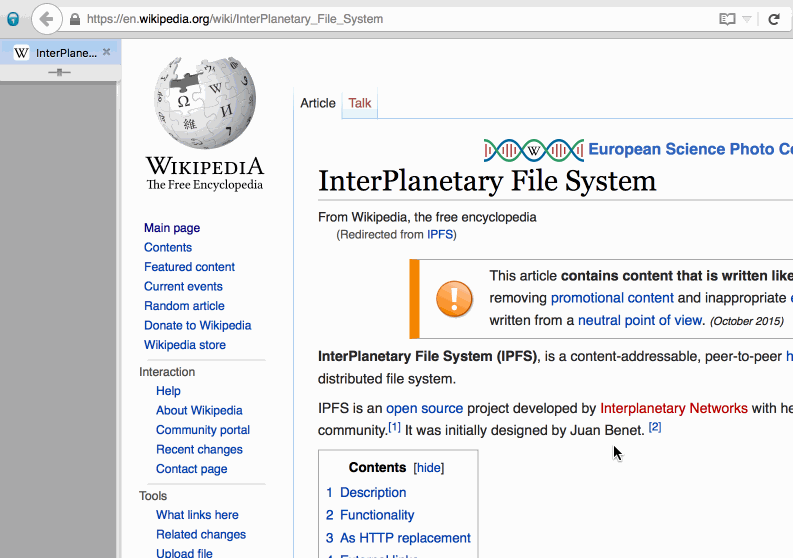

## IPFScrape

Takes a URL (webpage), downloads all the contents (css, images, scripts needed) for a page and dumps it into IPFS, providing you with a public link and a local link. Use for making quick copies of websites or permanent copies that you can send to friends.

Quick tool I wrote during the first Open Source Day at Typeform.

## Usage

* Clone repository
* Run `./run.sh $URL`
  * Example: `./run.sh https://en.wikipedia.org/wiki/InterPlanetary_File_System`
* Look at the bottom of the output, two links are provided. One `localhost` for you own, local pleasure. And one to the public gateway, `ipfs.io` that you can send to other people. Note: You'll need to be online for the public gateway to be able to download the site from you.

## Contributing

* Clone repository
* Make wanted changes
* Make PR
* Enjoy life of making IPFScrape better!

## License

Copyright (c) 2015 Victor Bjelkholm

Permission is hereby granted, free of charge, to any person obtaining a copy
of this software and associated documentation files (the "Software"), to deal
in the Software without restriction, including without limitation the rights
to use, copy, modify, merge, publish, distribute, sublicense, and/or sell
copies of the Software, and to permit persons to whom the Software is
furnished to do so, subject to the following conditions:

The above copyright notice and this permission notice shall be included in
all copies or substantial portions of the Software.

THE SOFTWARE IS PROVIDED "AS IS", WITHOUT WARRANTY OF ANY KIND, EXPRESS OR
IMPLIED, INCLUDING BUT NOT LIMITED TO THE WARRANTIES OF MERCHANTABILITY,
FITNESS FOR A PARTICULAR PURPOSE AND NONINFRINGEMENT.  IN NO EVENT SHALL THE
AUTHORS OR COPYRIGHT HOLDERS BE LIABLE FOR ANY CLAIM, DAMAGES OR OTHER
LIABILITY, WHETHER IN AN ACTION OF CONTRACT, TORT OR OTHERWISE, ARISING FROM,
OUT OF OR IN CONNECTION WITH THE SOFTWARE OR THE USE OR OTHER DEALINGS IN
THE SOFTWARE.
